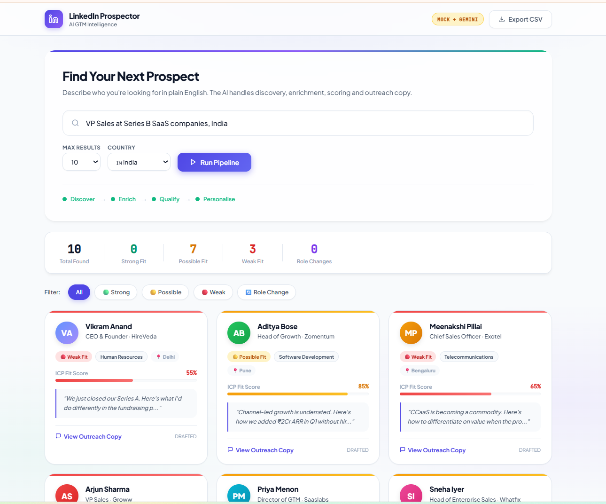
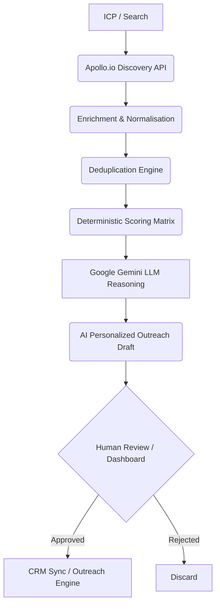

# AI-Powered GTM Prospecting & Research Platform



An end-to-end GTM automation system for prospect discovery, enrichment, ICP qualification, personalized outreach, human approval, and CRM handoff. Designed for high-velocity outbound sales teams.


---

## Architecture



---

## Key Features

1. **AI-Driven ICP Qualification:** Uses Google Gemini to score prospects qualitatively (Reasons & Risks) paired with a deterministic base score matrix (Industry, Role, Size, Signals).
2. **Deduplication Engine:** Prevents duplicate enrichment API calls and tracks prospect lifecycle intelligently to save API credits.
3. **Explicit State Machine:** Enforces strict pipeline transitions (`DISCOVERED -> ENRICHED -> QUALIFIED -> DRAFTED -> PENDING_REVIEW -> APPROVED -> ROUTED -> EXPORTED -> CONTACTED`).
4. **HubSpot CRM Integration:** Pushes qualified contacts and personalized outreach drafts directly into HubSpot.
5. **Observability:** Pipeline metrics tracking, failure recovery states, and a `/api/metrics` endpoint.
6. **Mock Architecture:** Built with a resilient hybrid-mock mode so the frontend, state machine, and AI can be developed or demoed locally without burning API credits.

---

## Quick Start (Mock Mode)

By default, the application runs in a Hybrid Mock Mode. It uses synthetic profiles to save API credits, but still uses live AI to evaluate them.

```bash
# Clone / navigate to project
cd linkedin-prospector

# Install dependencies
pip install -r requirements.txt

# Start the server (Database is auto-generated)
uvicorn app.main:app --reload
```
Navigate to `http://localhost:8000` to view the dashboard!

---

## Environment Variables (Live Data)

To unlock live Apollo data, real AI, and CRM sync, create a `.env` file in the root directory:

| Variable | Source | Effect |
|---|---|---|
| `APOLLO_API_KEY` | apollo.io | Live B2B LinkedIn prospect data |
| `GEMINI_API_KEY` | aistudio.google.com | Live LLM reasoning & outreach drafting |
| `HUBSPOT_ACCESS_TOKEN` | HubSpot | Real CRM export |

---

## B2B Data Strategy

Unauthorized scraping of LinkedIn violates Terms of Service. This project uses **Apollo.io** — a licensed API that redistributes B2B data compliantly. **Mock mode** (default fallback) uses highly-realistic fixture profiles so the entire stack can be tested without API keys.
